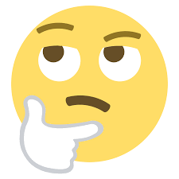
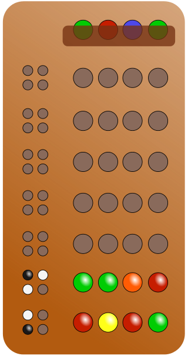

## Project 3  MASTERMIND

## Table of contents
- [How does it work?](#how-does-it-work?)
- [Home](#home)
- [About](#about)
- [Login](#login)
- [Select colors](#selectcolors)
- [Start game](#startGame)
- [Improvements](#improvements)
- [Licence and Copyright](#licence-and-copyright)

### How does it work?
This **mastermind** replica I have summarised to run a single level of the game, which is comprised of home screen with two buttons **play** and **about**, play leads to the logging screen for user registration, about leads to the game instructions, here you will find two buttons **home** and **next**, home links to the home screen and next to the logging screen.
Once registered, the player has the option to press two buttons **start** and **home**, home will take him to the colour selection screen to start the game. 
After that, you will find a row of buttons which you will have to press to obtain the colours with which you will play on the board, 
then you must go to the next screen where you can check each time you want your combination until you get the secret combination with the use of the 
secret combination with the use of the button **check** that will generate dynamically other rows allowing the option to more attempts also having a series of four circles
which indicate red clues if you do not have your colours in the correct position or are not the right colour and green if you have managed to match any colour with its position, if it is the right colour. 
Once the combination is finally found, the system will send a congratulatory message.

## Home

## About

## Login

## Select colors

## Start game

## Improvements
From this experience, I will include new modules of different levels to the game, and I will improve the already included level, punctually in the colours of the cards that give clues to the player for black and white, since to go with just time for the delivery of the project I did not make change of bottom of the screens the colour does not favour any element that contains black colour, among other improvements that I consider at the moment of the development.

### Licence and Copyright
The replica of this board game is based on the original which belongs to a trademark owned by Pressman Toys; the origin may derive from a traditional English game called Bulls and Cows, played on paper: the "bulls" were equivalent to the black pieces, and the "cows" to the white ones.
The toy museum in Denia (Alicante) exhibits this game under the commercial name of Conygan. From the Cayro toy factory and year of manufacture 1965.

