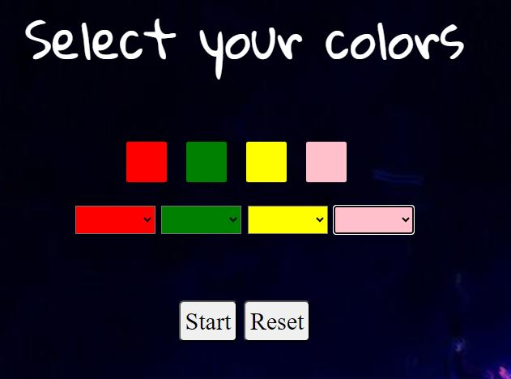

## Project 3  MASTERMIND

## Table of contents
- [How does it work?](#how-does-it-work?)
- [Home](#home)
- [About](#about)
- [Login](#login)
- [Select colors](#selectcolors)
- [Start game](#startGame)
- [Congratulations](#congratulations)
- [Improvements](#improvements)
- [Technology](#technology)
- [Licence and Copyright](#licence-and-copyright)

### How does it work?
This **mastermind** replica I have summarised to run a single level of the game, which is comprised of home screen with two buttons **play** and **about**, play leads to the logging screen for user registration, about leads to the game instructions, here you will find two buttons **home** and **next**, home links to the home screen and next to the logging screen.
Once registered, the player has the option to press two buttons **start** and **home**, home will take him to the colour selection screen to start the game. 
After that, you will find a row of buttons which you will have to press to obtain the colours with which you will play on the board, 
then you must go to the next screen where you can check each time you want your combination until you get the secret combination with the use of the 
secret combination with the use of the button **check** that will generate dynamically other rows allowing the option to more attempts also having a series of four circles
which indicate red clues if you do not have your colours in the correct position or are not the right colour and green if you have managed to match any colour with its position, if it is the right colour. 
Once the combination is finally found, the system will send a congratulatory message.

## Home

## About

## Login

## Select colors

## Start game

## Congratulations

## Technology

## Improvements
From this experience, I will include new level modules to the game, and I will improve the already included level, punctually in the colours of the tiles that give clues to the player by black and white, this replica uses the colours red and green.
that give clues to the player by black and white, this replica uses the colours red and green due to the selected screen background which does not favour the use of the colours of the tiles of the original game. 
of the original game.

### Licence and Copyright
The replica of this board game is based on the original which belongs to a trademark owned by Pressman Toys; the origin may derive from a traditional English game called Bulls and Cows, played on paper: the "bulls" were equivalent to the black pieces, and the "cows" to the white ones.
The toy museum in Denia (Alicante) exhibits this game under the commercial name of Conygan. From the Cayro toy factory and year of manufacture 1965.

[you can see the project here](https://github.com/myrg15/startProyectMasterMind.github.io)
